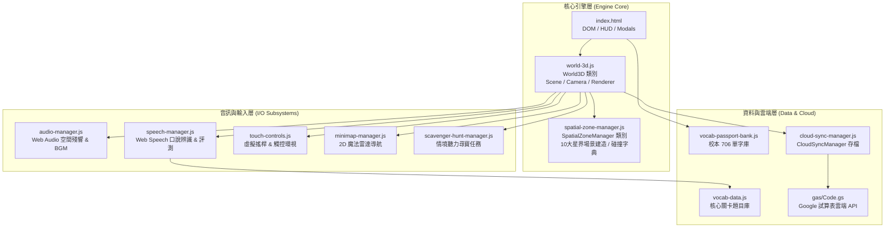

# 📘《童趣森林魔法書齋逃脫：蒼月之約》工程交接與協同作業說明書
## Engineering Handover & Operations Manual for Software Engineers

> **文件版本**：v2.4.0 (2026-10 最新實裝架構)  
> **專案性質**：Web 3D 第一人稱雙語教育沉浸式解謎遊戲 (Three.js + Web Speech API + Web Audio API)  
> **適用對象**：接手專案之軟體工程師、Code Reviewer、前端/遊戲開發人員  

---

## 📑 目錄 (Table of Contents)

1. [專案概覽與核心定位](#1-專案概覽與核心定位)
2. [程式目錄結構與核心檔案位置](#2-程式目錄結構與核心檔案位置)
3. [本地開發環境與運行方式](#3-本地開發環境與運行方式)
4. [版本控管、上傳與部署流程 (Git & GitHub Pages)](#4-版本控管上傳與部署流程-git--github-pages)
5. [全自動化模擬測試與檢核機制](#5-全自動化模擬測試與檢核機制)
6. [核心架構與底層機制詳解](#6-核心架構與底層機制詳解)
   - 6.1 [3D 渲染管線與畫質分級系統 (world-3d.js)](#61-3d-渲染管線與畫質分級系統-world-3djs)
   - 6.2 [十大星界空間與物理碰撞系統 (spatial-zone-manager.js)](#62-十大星界空間與物理碰撞系統-spatial-zone-managerjs)
   - 6.3 [程序化音訊合成器與智慧避讓 (audio-manager.js)](#63-程序化音訊合成器與智慧避讓-audio-managerjs)
   - 6.4 [AI 口說辨識與教學題庫閉環 (speech-manager.js & vocab-data.js)](#64-ai-口說辨識與教學題庫閉環-speech-managerjs--vocab-datajs)
   - 6.5 [2D 魔法雷達導航與情境聽力尋寶](#65-2d-魔法雷達導航與情境聽力尋寶)
   - 6.6 [Google Apps Script 雲端同步與學籍系統 (cloud-sync-manager.js)](#66-google-apps-script-雲端同步與學籍系統-cloud-sync-managerjs)
7. [常見修改與擴充實戰指引](#7-常見修改與擴充實戰指引)
   - 7.1 [如何新增或修改單字與關卡考驗](#71-如何新增或修改單字與關卡考驗)
   - 7.2 [如何在 3D 場景中增添道具與設定碰撞障礙](#72-如何在-3d-場景中增添道具與設定碰撞障礙)
   - 7.3 [如何更換或優化貼圖材質](#73-如何更換或優化貼圖材質)
8. [工程師注意事項與避坑指南 (Gotchas)](#8-工程師注意事項與避坑指南-gotchas)

---

## 1. 專案概覽與核心定位

### 1.1 專案背景與技術選型
本專案為一款為國中小學生量身打造的 **3D 第一人稱沉浸式英語口說與聽力冒險逃脫遊戲**，採用日系奇幻魔法學院風格（《葬送的芙莉蓮》氛圍）。

為確保校園低配備平板（如 iPad 9/10、Chromebook、低配筆電）與一般家用電腦皆能**零安裝、秒開即玩**，本專案刻意**摒棄肥大的傳統遊戲引擎 Web 匯出（如 Godot/Unity WASM 導出體積動輒 50MB+ 且受限於 COOP/COEP 跨域隔離標頭）**，採用以下**原生純前端現代 Web 標準技術棧**：

- **3D 渲染核心**：Three.js (r128，單檔約 600KB，零 npm 依賴包袱)
- **口說辨識引擎**：Web Speech API (`webkitSpeechRecognition`) 原生硬體加速
- **音訊與音樂合成**：Web Audio API 純代碼演算法合成（雙聲道空間殘響、多軌交響和弦、智慧教學音訊避讓）
- **雙模操作輸入**：虛擬搖桿 (觸控螢幕) + 鍵盤滑鼠 (WASD / 方向鍵 + 滑鼠指針鎖定)
- **雲端後端與存檔**：Google Apps Script (GAS) + Google Sheets 雲端試算表資料庫
- **前端部署**：GitHub Pages 靜態託管（自動支援 HTTPS）

### 1.2 遠端儲存庫與線上演示
- **GitHub 儲存庫**：`https://github.com/hs5743/whimsy-forest-escape.git`
- **主要分支**：`main`
- **線上體驗網址**：`https://hs5743.github.io/whimsy-forest-escape/`

---

## 2. 程式目錄結構與核心檔案位置

本專案採**高度解耦、高內聚、無大型建構工具打包流程（Zero Build Step）**之純原生 JavaScript 模組化設計。修改任何單一 `.js` 或 `.html` 檔案存檔後，重新整理瀏覽器即可立即見效。

```
c:\Antigravity 2026\whimsy-forest-escape\
├── index.html                      # 專案主入口，包含遊戲封面、故事繪本、HUD、單字卡、星圖、教學指南等全域 Modal 與 UI 佈局
├── world-3d.js                     # 3D 核心引擎：場景初始化、相機控制、玩家物理走位碰撞、畫質分級(高/中/低)、FPS即時監控面板
├── spatial-zone-manager.js         # 十大奇幻星界空間建造器 (Zone 1~10 幾何、360°圓柱全景天穹、守護者立體模型、碰撞盒字典)
├── audio-manager.js                # Web Audio API 音訊引擎：Convolution Reverb 物理殘響、多軌和弦墊、主題音樂、Smart Ducking
├── speech-manager.js               # 語音辨識管理器：口說評測、音節拆解 Chunks 比對、模糊容錯、外師真人 WAV 音檔播放
├── touch-controls.js               # 平板/手機虛擬搖桿、滑動視角環視與點擊互動適配器
├── cloud-sync-manager.js           # 雲端資料同步：學生護照登入、XP 等級計算、排行榜查詢、離線重傳佇列
├── minimap-manager.js              # 2D 魔法雷達小地圖：玩家即時座標箭頭、視野角錐、POI 導航標記
├── scavenger-hunt-manager.js       # 情境聽力尋寶系統：雷達聲納波紋指引、外師發音題庫判定
├── vocab-data.js                   # 核心 10 大星界互動單字庫 (單字、音標、IPA、中文、吉祥物頭像、匹配關鍵字)
├── vocab-passport-bank.js          # 校本 706 英語單字題庫管家 (自然發音、分級主題、音節拆解 Chunks)
├── style.css                       # 奇幻羊皮紙風格響應式樣式表、發光特效、按鈕動畫
├── three.min.js                    # Three.js 核心庫 (r128 版)
│
├── assets/                         # 靜態資源目錄
│   ├── sounds/
│   │   └── vocab/                  # 13 個核心教學單字之外師真人朗讀 WAV 高音質音檔
│   └── textures/                   # 51 張 AI 次世代高品質材質貼圖 (全景圖、守護者立繪、道具細節皮膚，總容量 < 20MB)
│
├── docs/                           # 專案技術架構說明文檔
│   ├── SYSTEM_ARCHITECTURE_AND_DEV_GUIDE.md
│   └── ENGINEERING_HANDOVER_MANUAL.md (本手冊)
│
├── gas/
│   └── Code.gs                     # Google Apps Script 雲端後端程式碼 (試算表讀寫、LockService 併發鎖)
│
└── scratch/
    └── test-simulation.js          # 全維度自動化驗證腳本 (包含 16 大節、439 項端到端與單元測試)
```

---

## 3. 本地開發環境與運行方式

### 3.1 前置環境需求
- **Node.js**：v16.0 或以上（主要用於執行自動化測試腳本及啟動本機 HTTP 伺服器）。
- **瀏覽器**：Google Chrome / Microsoft Edge / Safari（需支援 WebGL 與 Web Speech API，推薦 Chrome 獲得最佳語音體驗）。
- **Git**：版本控制工具。

### 3.2 啟動本機測試伺服器 (重要！)
> [!WARNING]
> 請**勿**直接以雙擊開啟方式 (`file:///.../index.html`) 運行遊戲！  
> 現代瀏覽器在 `file://` 協議下會基於安全性策略**阻擋 Web Audio API 的 AudioContext 載入、貼圖跨域讀取，以及 Web Speech API 的麥克風呼叫**。

請在專案根目錄開啟命令列（PowerShell / CMD / Bash），執行以下任一種本機伺服器：

```bash
# 方法 A: 使用 Node.js 的 serve (推薦)
npx serve .

# 方法 B: 使用 Python 內建 HTTP 伺服器
python -m http.server 8000

# 方法 C: 使用 VS Code 的 "Live Server" 擴充套件，點擊右下角 "Go Live"
```
啟動後，在瀏覽器網址列開啟：`http://localhost:3000` (或對應埠號) 即可流暢執行遊戲。

---

## 4. 版本控管、上傳與部署流程 (Git & GitHub Pages)

本專案採用最標準、穩健的 Git 工作流程。當您檢核完畢或修改了程式碼後，請依循以下步驟進行上傳與遠端部署：

### 4.1 拉取最新代碼 (Pull)
在進行修改前，務必確認已取得遠端儲存庫的最新變更：
```bash
cd "c:\Antigravity 2026\whimsy-forest-escape"
git checkout main
git pull origin main
```

### 4.2 檢視變更與執行測試 (Verify)
修改程式碼後，請先檢查修改狀態，並執行專案模擬測試（詳見第 5 節）：
```bash
git status
node scratch/test-simulation.js
```
> [!IMPORTANT]
> 請務必確認測試通過率為 **100.0% (439 / 439)** 始可提交！

### 4.3 暫存、提交與推送 (Commit & Push)
```bash
# 1. 暫存所有修改檔案
git add -A

# 2. 撰寫清晰符合語意的 Commit Message (如 feat / fix / refactor / docs)
git commit -m "feat: [描述您新增的功能或修復的問題]"

# 3. 推送至遠端 main 分支
git push origin main
```

### 4.4 GitHub Pages 自動部署驗證
- 本專案已將 GitHub Pages 的發布來源設定為 `main` 分支的根目錄 (`/`)。
- 當 `git push origin main` 成功後，GitHub 會自動觸發 Pages 構建與部署流程。
- 通常等待約 **1 到 2 分鐘**，造訪公開網址即可檢驗最新線上成果：  
  👉 **`https://hs5743.github.io/whimsy-forest-escape/`**

---

## 5. 全自動化模擬測試與檢核機制

為確保程式碼在重構或擴充時絕不發生功能迴歸，專案包含了一套無周邊（Headless）全維度自動化驗證測試套件：
**`scratch/test-simulation.js`**

### 5.1 執行方式
```bash
node scratch/test-simulation.js
```

### 5.2 測試覆蓋範圍 (共 16 大節、439 項斷言)
1. **生成點安全性**：驗證全部 10 大星界玩家 Spawn Point 無穿牆、無障礙物重疊。
2. **障礙物防穿透實體測試**：測試各區邊界、石牆、建築、大樹、機關車之 AABB 碰撞阻擋。
3. **聽力尋寶雷達測試**：驗證 10 大星界之尋寶 POI 座標均在可抵達邊界內。
4. **單字題庫防呆驗證**：驗證 10 大星界關卡單字零重複、自然發音與關鍵字配置完整。
5. **3D 幾何與動態物件註冊**：驗證切換至各星界時 interactables (可互動清單) 與 animators (每幀動畫清單) 數量皆達標。
6. **全景圖與守護者立繪存在性**：檢查全部 51 張貼圖檔案之存在性、容量與解析度規格。
7. **渲染管線升級指標**：驗證 sRGB、ACESFilmic、2048px 柔和陰影、Godray 斜射光束、暗角遮罩等配置。
8. **Web Audio 音訊引擎**：驗證 Convolution Reverb、多軌和弦墊、Smart Ducking 避讓函式。
9. **四大守護者 BOSS 立繪**：驗證對話框與單字卡之導師頭像精準綁定專屬立繪。
10. **第一批畫面質感 (Batch 1)**：驗證 PMREM 全景環境反射 IBL、畫質分級 (High/Medium/Low)、FPS 監控膠囊面板、自動降級邏輯，以及程序化圓形柔邊微粒。

---

## 6. 核心架構與底層機制詳解



### 6.1 3D 渲染管線與畫質分級系統 (`world-3d.js`)
- **入口實例**：`window.world3D = new World3D();`
- **畫質預設控制**：`world3D.setGraphicQuality(quality, isAuto)`
  - `'high'`：`pixelRatio = min(DPR, 2.0)`、`shadowMap` 啟用且解析度 2048x2048、`scene.environment` (PMREM) 啟用、粒子微塵 100%。
  - `'medium'`：`pixelRatio = min(DPR, 1.5)`、`shadowMap` 1024x1024、`scene.environment` 啟用、粒子微塵 70%。
  - `'low'`：`pixelRatio = 1.0`、關閉陰影計算 (`shadowMap.enabled = false`)、關閉環境反射 (`scene.environment = null`)、粒子 30%。
- **FPS 監控與智慧平滑降級**：
  - 在 `animate()` 迴圈中，利用滑動加權平均：`rollingFps = rollingFps * 0.92 + currentFps * 0.08`。
  - 當連續 4 秒幀率低於 28 FPS 且畫質高於 low 時，系統自動向下調降一級並彈出 Toast 提示，確保學童不會因發熱掉幀而卡死。
  - 頂部 HUD 設置 `#fpsQualityPill` 膠囊按鈕，點擊可手動循環切換 `high -> medium -> low -> high`。

### 6.2 十大星界空間與物理碰撞系統 (`spatial-zone-manager.js`)
- **星界列表**：
  1. `zone1`: 見習學徒書齋 (Atelier Room)
  2. `zone2`: 陽光微風市集 (Sunbreeze Market)
  3. `zone3`: 守護獸花園 (Enchanted Garden)
  4. `zone4`: 活力運動操場 (Athletic Park)
  5. `zone5`: 星光鐘樓車站 (Steam Clocktower Station)
  6. `zone6`: 蔚藍秘境海港 (Azure Harbor)
  7. `zone7`: 雲頂星空觀測站 (Starlit Observatory)
  8. `zone8`: 極光冰雪聖域 (Aurora Glacier Sanctuary)
  9. `zone9`: 星界萬神殿堂 (Astral Pantheon)
  10. `zone10`: 蒼穹虹光空島 (Rainbow Sky Island)
- **空間切換機制 (`switchZone(zoneId)`)**：
  1. 清理舊空間之 `activeZoneGroup`、清空 `world.interactables` 與 `world.animators`。
  2. 呼叫 `setupZoneSkyAndAtmosphere(group, zoneId)` 設定背景色、大氣霧氣，並呼叫 `setupZoneEnvironment(zoneId)` 透過 PMREM 編譯對應之 360° 全景圖，將真實天光注入 `world.scene.environment`。
  3. 執行對應的 `buildZoneX(group)`，生成 3D 地形、建築、POI 道具與守護者模型。
  4. 通知 `audioManager.setZone(zoneId)` 平滑切換專屬主題 BGM，並重設玩家生成點。
- **物理碰撞判定 (`world-3d.js` 的 `isPositionBlocked(x, z, radius)`)**：
  - 採用高效能 2D AABB 軸向包圍盒檢測。
  - 每個星界定義了專屬的障礙物清單 `this.colliders[zoneId]`，元素結構如：`{ type: 'box', minX, maxX, minZ, maxZ }`。

### 6.3 程序化音訊合成器與智慧避讓 (`audio-manager.js`)
- **零外部 MP3/WAV 音檔依賴**：除了外師單字朗讀使用真實 WAV 以外，全遊戲的背景音樂（BGM）與互動音效（拾取、調配、開門、傳送、勝利）皆由 Web Audio API 即時運算震盪器（Oscillators）與濾波器合成。
- **雙聲道空間殘響 (Convolution Reverb)**：利用白噪音衰減演算法動態產生物理 Impulse Response，營造出大教堂與古代殿堂般的廣闊空間共鳴。
- **教學智慧音訊避讓 (Smart Ducking)**：
  - 當學童點擊外師發音朗讀，或開啟麥克風進行口說辨識時，音訊引擎會平滑調降 BGM 音量至 25% (`duckBgm()`)，避免音樂干擾語音辨識率。
  - 口說完畢或發音結束後，BGM 於 1.2 秒內以線性曲線平滑恢復至正常音量 (`unduckBgm()`)。

### 6.4 AI 口說辨識與教學題庫閉環 (`speech-manager.js` & `vocab-data.js`)
- **真名詠唱機制**：學童靠近 3D 物件（如燭台 `LIGHT`、寶箱 `KEY`、帆船 `SHIP`）按下互動時，彈出單字卡視窗。
- **語音評測流程**：
  1. 呼叫外師真人發音示范 (`playWordVoice`)。
  2. 啟動麥克風錄音 (`startListening`)，利用瀏覽器原生語音引擎獲取用戶語音轉文字（STT）。
  3. 執行 `evaluatePronunciation`：具備自然發音、關鍵字容錯（如去除標點符號、比對常見連音同音詞）。
  4. 若判定通過：播放成功水晶音效，授予經驗值 XP，解開該 3D 機關或觸發動畫，並寫入雲端護照。
  5. 備用友善機制：包含「老師協助通關 (Force Pass)」按鈕，避免特殊環境（如吵雜教室或無麥克風電腦）造成學生無法推進劇情。

### 6.5 2D 魔法雷達導航與情境聽力尋寶
- **魔法雷達 (`minimap-manager.js`)**：在遊戲畫面右上角繪製 Canvas 2D 雷達，即時反映玩家當前座標、朝向角度、空間邊界、尋寶目標金色指示點與守護者符號。
- **情境聽力尋寶 (`scavenger-hunt-manager.js`)**：按下鍵盤 `[H]` 鍵或點擊 HUD 快捷鈕啟動。系統播放外師謎題語音，玩家必須藉由雷達方位指示與空間指引波紋，在 3D 世界中尋獲對應物品。

### 6.6 Google Apps Script 雲端同步與學籍系統 (`cloud-sync-manager.js`)
- **免資料庫伺服器架構**：使用 Google Apps Script (GAS) 部署為 Web App，以 Google Sheets 作為後端資料庫。
- **離線容錯保護**：斷網時自動存入 `localStorage`，網絡恢復後自動佇列重傳。
- **數值公式**：等級曲線計算 `calculateLevel(xp)` 依循公式：$Level = \lfloor (\frac{XP}{100})^{\frac{1}{1.35}} \rfloor + 1$。

---

## 7. 常見修改與擴充實戰指引

### 7.1 如何新增或修改單字與關卡考驗
1. **修改關卡核心單字庫 (`vocab-data.js`)**：
   - 找到對應單字物件（如 `SHIP`, `MOON`, `SNOW`），可修改其 `zh` (中文釋義)、`phonics` (自然發音音標)、`mascotImg` (導師立繪)、`matchKeywords` (允許辨識通過的容錯關鍵字字串陣列)。
2. **修改守護者三大試煉題庫**：
   - 搜尋 `vocab-data.js` 中的 `GUARDIAN_TRIALS` 物件，可針對各星界 (`zone1` ~ `zone10`) 的試煉問句、選項答案與對話文本進行擴充。

### 7.2 如何在 3D 場景中增添道具與設定碰撞障礙
若要在特定星界（例如 `zone6` 海港）中增加一個木桶或石碑：
1. 開啟 `spatial-zone-manager.js`，搜尋對應建造函式（如 `buildZone6_Harbor`）。
2. 使用 Three.js 建立 3D Mesh 並加入到 `group`：
   ```javascript
   const barrelGeo = new THREE.CylinderGeometry(0.5, 0.5, 1.2, 16);
   const barrelMat = new THREE.MeshStandardMaterial({ map: this.tex.dockWood, roughness: 0.7 });
   const barrel = new THREE.Mesh(barrelGeo, barrelMat);
   barrel.position.set(4.5, 0.6, -3.2);
   barrel.castShadow = true;
   barrel.receiveShadow = true;
   group.add(barrel);
   ```
3. 若該物件**不可被玩家穿透**，請在 `initColliders()` 的對應星界區塊中登記 AABB 判定盒：
   ```javascript
   // 在 zone6 的碰撞盒陣列中加入：
   { type: 'box', minX: 3.9, maxX: 5.1, minZ: -3.8, maxZ: -2.6 }
   ```
4. 若該物件為**可點擊之口說教學道具**，請設定 `barrel.userData.interactType = 'speech'` 並加入 `this.world.interactables.push(barrel)`。

### 7.3 如何更換或優化貼圖材質
1. 貼圖圖檔皆存放於 `assets/textures/`。
2. 命名規範請遵循既有命名（全小寫底線或連字號，如 `steam_locomotive_detail.jpg`）。
3. 貼圖優化準則：
   - 全景圖 (Panorama)：建議尺寸 2048x1024 或 4096x2048，JPEG 品質 80~85%，容量控制在 350KB 以下。
   - 角色立繪 (Portrait)：建議尺寸 768x1024，JPEG 品質 85%，容量控制在 300KB 以下。
   - 道具表面皮膚 (Props)：建議尺寸 1024x1024，JPEG 品質 80%，容量控制在 400KB 以下。
4. 更換檔案後，執行 `node scratch/test-simulation.js` 確認第 16 節的總貼圖容量驗證（需 <= 21MB）依然通過。

---

## 8. 工程師注意事項與避坑指南 (Gotchas)

1. **千萬不要手動破壞 `depthWrite: false` 的粒子材質**：
   - 所有 `PointsMaterial`（包括微塵、星辰、水花、煙霧、雪花）都已配置 `depthWrite: false` 與 `createSoftCircleParticleTexture()`。如果改為 `depthWrite: true`，半透明粒子在物體邊緣會產生嚴重的黑色矩形邊框穿幫！
2. **相機裁剪面 (Frustum Clipping)**：
   - 戶外各星界的全景穹頂半徑約 90m 左右，因此 `world-3d.js` 中相機的 Far 裁剪面設為 `400`（`new THREE.PerspectiveCamera(65, aspect, 0.1, 400)`），請切勿調小低於 150，否則遠處全景天穹會被切掉變成黑色虛空。
3. **避免在 `animate()` 迴圈中宣告 `new THREE.Vector3()` 或建立新物件**：
   - 每一幀 (60 FPS) 頻繁分配記憶體會觸發 JavaScript 引擎的垃圾回收（Garbage Collection, GC），導致畫面間歇性微卡頓（Micro-stuttering）。請重用既有 Vector 或使用快取純量。
4. **移動端觸控與滾動衝突**：
   - `index.html` 與 `style.css` 已配置 `touch-action: none` 防止雙指縮放或頁面滑動干擾 3D 搖桿。在為彈窗設計滾動條時，彈窗內部容器需明確指定 `touch-action: pan-y; overflow-y: auto;`。
5. **瀏覽器自動播放音訊限制 (Autoplay Policy)**：
   - 現代瀏覽器規定未經用戶互動（點擊或按鍵）前，不得主動播放聲音。因此遊戲設計了「封面頁面」與「踏上冒險旅程」按鈕，在用戶點擊該按鈕瞬間解鎖 `AudioContext.resume()`。

---

> 祝您檢核與協同開發順利！如有任何架構設計疑問，隨時可以參閱本專案各模組開頭之詳細註解，或利用 `node scratch/test-simulation.js` 快速定位邏輯行為。
